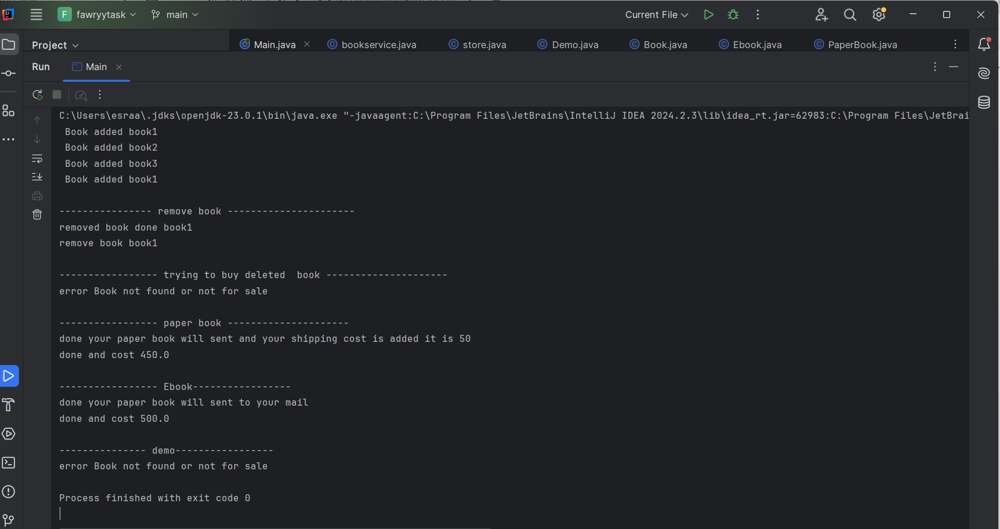

# 📚  Bookstore Console App

This is a simple Java console application that simulates a bookstore system with different types of books.

---

## ✅ Features

- Add different types of books to inventory:
  - PaperBook (can be shipped)
  - EBook (sent via email)
  - DemoBook (not for sale)
- Remove outdated books based on age
- Purchase available books (EBook/PaperBook only)
- Handle quantity, delivery address, and email

---

## 🚀 How to Run

1. Open the project in IntelliJ or any Java IDE
2. Run the `Main.java` file
3. Interact through the console

---

## 📸 Screenshot

> Below is a screenshot from the running app:

---

## 🔧 Technologies Used

- Java (OOP principles)
- IntelliJ IDEA
- Git & GitHub

---

## 🧑‍💻 Author

Esraa Mahmoud  
[GitHub Profile](https://github.com/esraamahmoudd)
